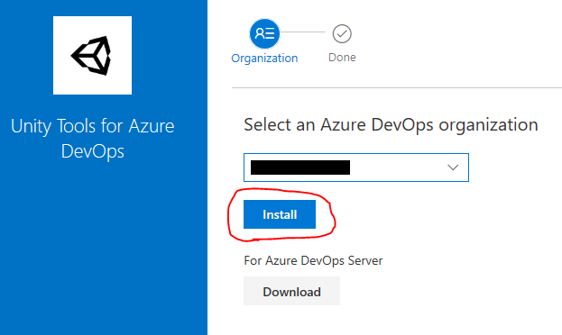

This Azure DevOps extension contains build and release tasks for use in Azure Pipelines to implement continuous intergration and delivery with Unity 3D projects. This documentation will guide you on how to setup your pipeilnes and get started using the extension.

## 1. Installing the extension
Please install the extension ["Unity Tools for Azure DevOps"](https://marketplace.visualstudio.com/items?itemName=DinomiteStudios.64e90d50-a9c0-11e8-a356-d3eab7857116) for use in your Azure DevOps organization.

Now that you have installed the extension, you can use the following tasks in your pipelines:

**Unity Get Project Version**

Use this task to read the Unity Editor version required by your project. This task is particularly useful when working with hosted agents and you need to make sure the proper Unity Editor gets installed before the build.

**Unity Activate License**

Use this task to activate a license on the agent before building. Once the pipeline has finished building, the license activation gets released again.

**Unity Build**

Use this task to actually build your Unity project and get the build output files for following tasks to process.

## 2. Supported Build Agents
The extension supports Microsoft hosted agents as well as custom agents. Some of Unity's target build platforms are not supported on hosted agents, since they require manual configuration of SDKs & Tools, which we can't do on hosted agents. For full control over the tools and software, we recommend using your own build agent. This table illustrates the supported platforms on either agent:

| Target Platform            |                             Hosted Agents                            |    Custom Agents   |
|----------------------------|:--------------------------------------------------------------------:|:------------------:|
| PC & Mac Standalone        |                          :heavy_check_mark:                          | :heavy_check_mark: |
| Android                    | :x: Android requires SDK / NDK paths to be set in editor preferences | :heavy_check_mark: |
| iOS                        | :heavy_check_mark:                                                   | :heavy_check_mark: |
| tvOS                       | :heavy_check_mark:                                                   | :heavy_check_mark: |
| Universal Windows Platform | :heavy_check_mark:                                                   | :heavy_check_mark: |
| WebGL                      | :heavy_check_mark:                                                   | :heavy_check_mark: |

### 2.1 Configuring a custom agent
Setting up your own agent is a one time operation and quite easy to do. We've prepared setup guides to help you get started. For a full documentation on how to setup build agents, please refer to the official documentation by Microsoft.

* [Setup Windows Agent](setup-windows-agent.md)
* [Setup macOS Agent](setup-mac-os-agent.md)

## 3. Define build pipelines
Feel free to use one of these guides to get you started building for your desired platform. Keep in mind every project has different requirements and your pipeline might require additional steps.

* [PC & Mac Standalone](standalone-pipeline.md)
* [iOS](ios-pipeline.md)
* [tvOS](tvos-pipeline.md)
* [Android](android-pipeline.md)
* [Universal Windows Platform](uwp-pipeline.md)
* [WebGL](web-gl-pipeline.md)
